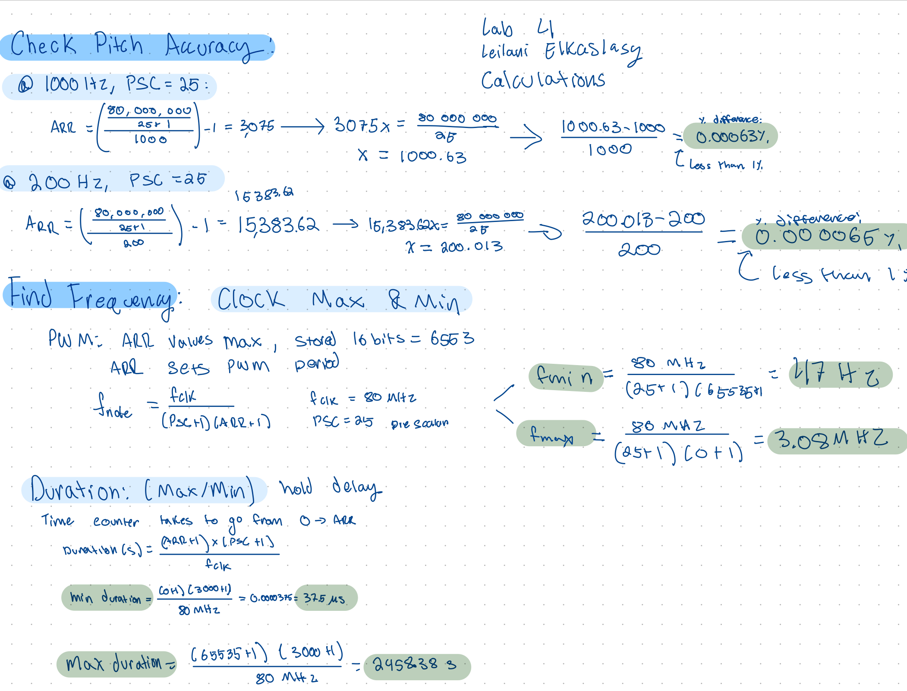
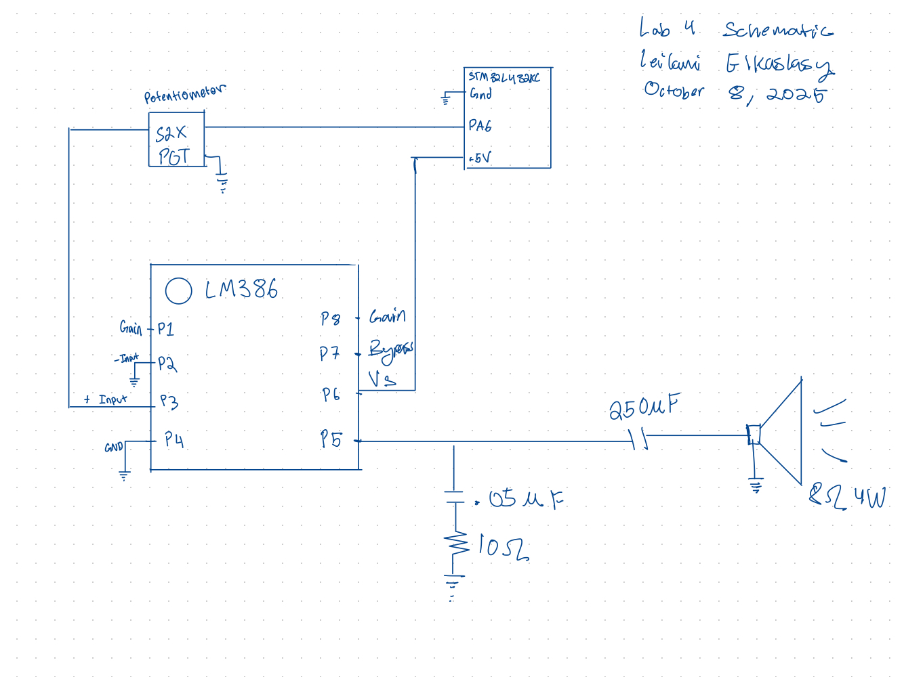
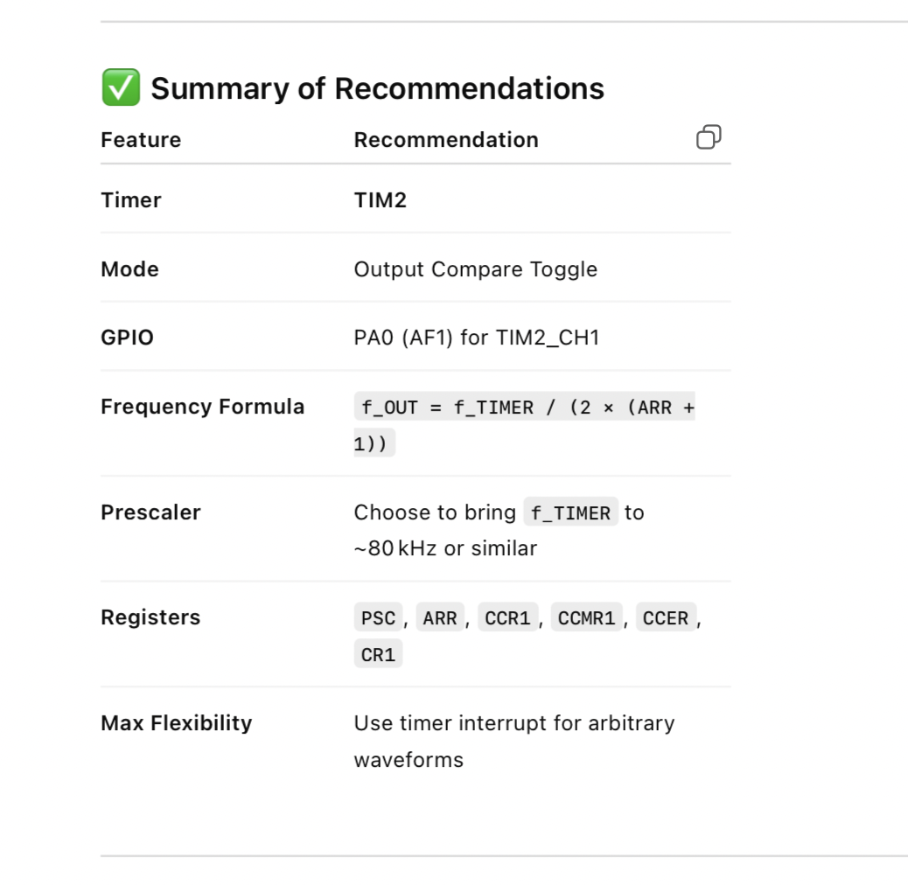
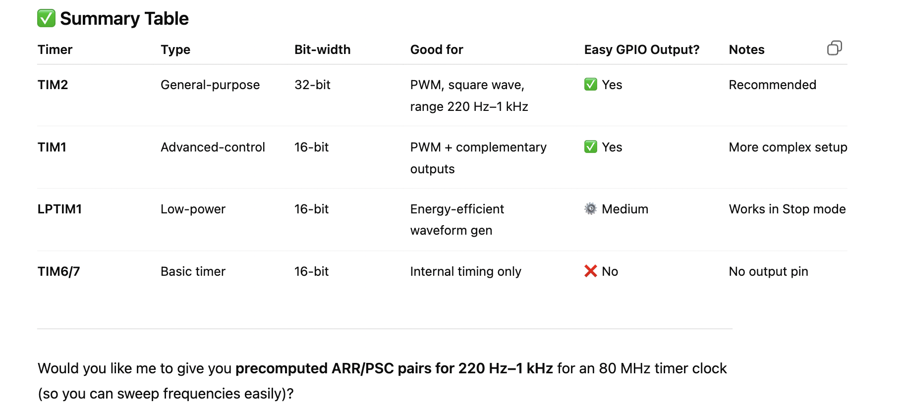

## Introduction 
In this lab an STMLK324KC microcontroller was programmed to interface with a speaker and play two songs: Fur Elise and Jingle Bells. For this lab the MCU's memory map and timing peripherals had to be leveraged facilitating familiarity with the STMLK32KC data sheet navigation. 

## Design  and Testing Methodology 
This labs design was encoded in C with libraries from the E 155 course as a jumping off point. Primarily the GPIO and RCC libraries were used. However the PWM and timer peripheral files had to be implemented. In order to do so a close reading of the reference manual and data sheet was neccescary to understand these functions and how to implement them. The timers selected for this lab were TIM15 and TIM16. TIM15 as a standard counter and TIM16 as the PWM. For the PWM the duty cycle was fixed to a value of 50% in order to ensure that the sound outputs would not be distorted. The timer and PWM were routed to the speaker through the LMA386 audio amplifier chip and a potnetiometer for volume control.

## Technial Documentation
Github repository containing all code used for this lab:
<https://github.com/lanilei/E155labs/tree/main/lab4>

## Calculations 

### Schematic
Following the LMA386 data sheet the following circuit was implemented 

## Results and Discussion 
The speaker played fur elise and jingle bells when the code was uploaded onto the MCU. The volume was easily controlled using the potentiometer. 

## Testing
The circuit was tested using an oscilliscope to ensure poper signals were being output. All C files compiled without flagging any bugs.  

## Conclusion 

This lab took 20 hours.  Through breadboarding, programming, and debugging a digital audio system was fully realized.

## AI Results Summary 
AI was asked "What timers should I use on the STM32L432KC to generate frequencies ranging from 220Hz to 1kHz? What’s the best choice of timer if I want to easily connect it to a GPIO pin? What formulae are relevant, and what registers need to be set to configure them properly?""

As per usual Chat GPT was able to come up with an anser in a matter of seconds for what took me manually about an hour to figure out.  It seems to be that it went with the first possible answer choosing TIM2 in both the cases where it was asked to browse the reference manual and the case where it was asked to answer without attatching the reference manual. Although it went with the first option that worked credit is due for skipping over TIM1. TIM2 is PWM capable and therefore not a bad choice. However I found that TIM 15/16 were better suited to my needs for this lab when repeating this process manually. 
I think it did point me in a write direction and was better and more efficient than "Ctrl F" in the refererence manual. That said,I'd like to further explore uploading the manual and asking it questions about the manual. 

When I asked to summarise all my timer options it returned thsi summary table. I like the idea that I can then choose for myself what best fits my project but also that I can obtain targetted information. 
