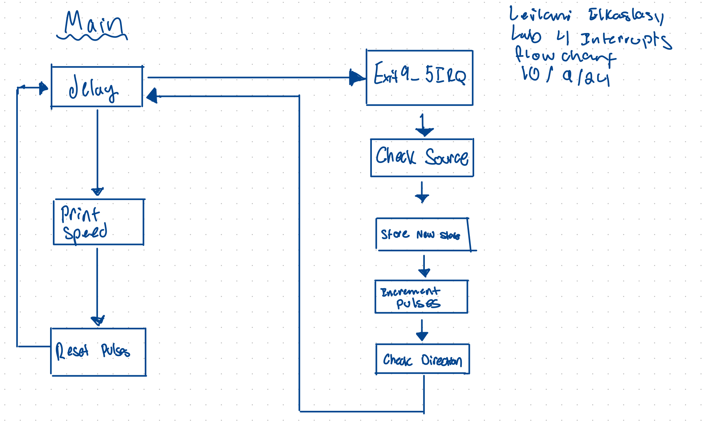
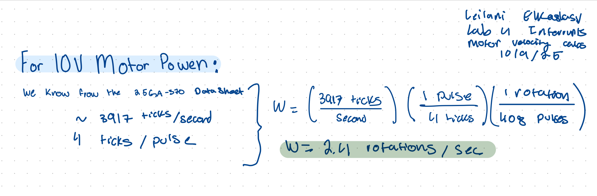
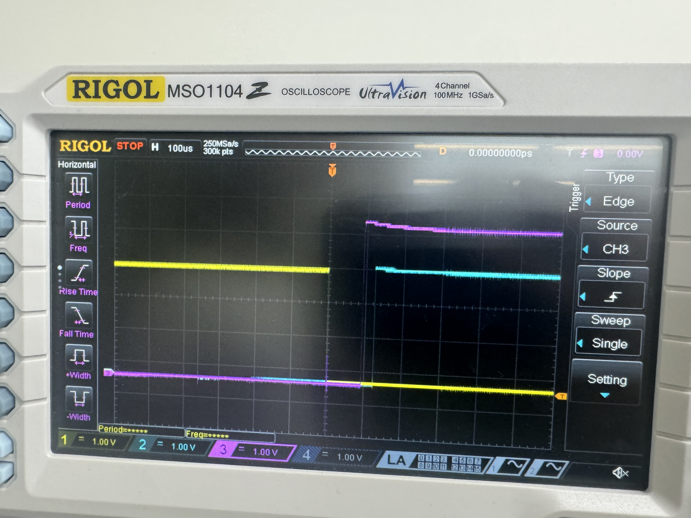

## Introduction 
In this lab an STMLK324KC microcontroller was programmed to interface with a motor to measure the rotational speed an direction of its spin through a quadrature encoder. The moter output two square waves that were 90 degrees out of phase and interrupts were used to extract the rotations per second and the direction of rotation with both accuracy and preciscion. 

## Design  and Testing Methodology 
The system was esigned to interpret two optical quarature sensors that produced square wave sthat were out of phase by 90 degrees. All edges of the signals generate an interrupt. 
This labs design was encoded in C with libraries from the E 155 course as a jumping off point. 

## Technial Documentation
Github repository containing all code used for this lab:
<https://github.com/lanilei/E155labs/tree/main/lab5>

### System Flow Chart
This chart shows an overview of the interrupt and encoder interpratation system implemented. The sequence on the left shows the main loop wich interafaces with the interrupt handler on the right. 

## Calculations 
The interrupt works by incrementing the conter at each rising and falling edge for both uadrature signals. The count over the course of a second is converted to angular velocity as revolutions per second. The interrupt increments by four for each measured pulse  which is why we apply the correction factors. The datasheet for the motor state sthat there are 408 pulses per revolution which we can extrapolate to find the target velocity. BY confirming the results with the datasheet, the system is deemd to operate accuratley.

### Schematic
Following the LTS-25Ga370H-34 data sheet the following circuit was implememted to interface signal A and B with pins 6 and 8 on the MCU which are 5V tolerant. The power for the Quadrature and Gnd were provided by the MCU and the motor was powered by a power supply. 

## Results and Discussion 
The interrupt based encoder implemented in this lab provided accurate velocity measurements in rotations/s and dependable direction readings in clockwise denoted as CW and counter-clockwise denoted as CCW. The interrupts were cirical to this lab as they allowed the MCU to complete other tasks while aiting for an encoder signal, this improved system efficiency and responsiveness for high speed resolution. By incrementing the counter on both the positive and negative edges of encoder singals high speed was bolstered. 

Polling has many limitations that made interrupts an ideal choice for this lab. The primary limitation is the polling requries that the encoder flags are constantly monitered- this creates a high consuption of CPU resources- primarily time and power. Polling can also often be too slow which could incorrectly skew data. For the time sensitive control required by this lab- polling was unsuitable. 

## Testing
The circuit was tested using an oscilliscope to ensure poper signals were being output. All C files compiled without flagging any bugs.  

## Conclusion 

This lab met all required specs. Implementing this lab took 30 hours.  Through breadboarding, programming, and debugging the motor with real time angular velocity and spin direction output was realized. 

## AI Prototype Summary 
AI was prompted, "Write me interrupt handlers to interface with a quadrature encoder. I’m using the STM32L432KC, what pins should I connect the encoder to in order to allow it to easily trigger the interrupts?" 
It was suprising that chat GPT suggested the use of Hardware Timer in Encoder mode first over the use of an interrupt as the prompt asked for a interrupt. When guided towards an interrupt. The Code generated when asked for an interrupt did not compile and erros were flagged on nearly every line of code. q

