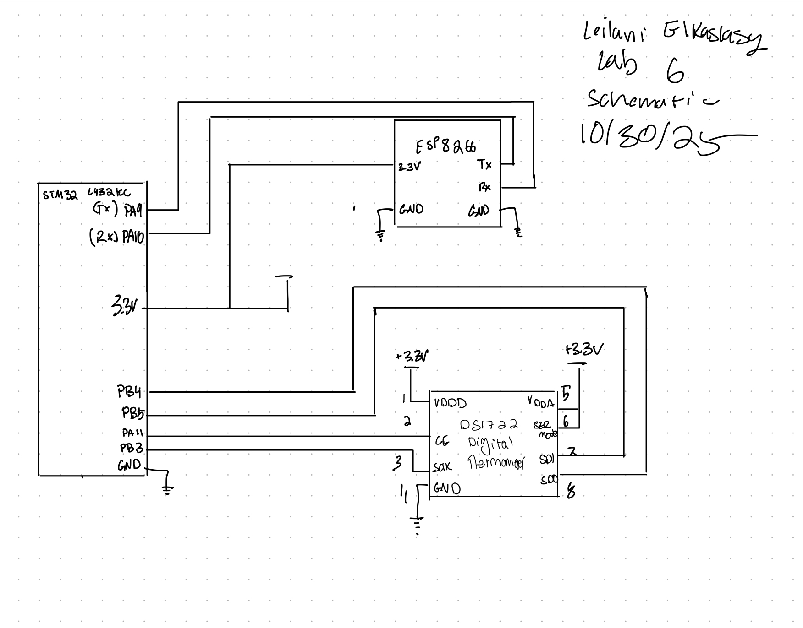
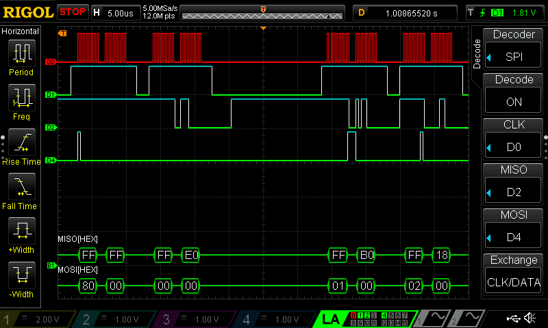

---

## Introduction 
In this lab an STMLK324KC microcontroller was programmed to interface with a DS1722 SPI temperature seensor and a UART ESP8266 module. The DS1722 was successfully able to read temperature annd relay that information  to the microcontroller which then used the ESP8266 to host a HTML web server to view the real time temperature readings. THe HTML webserver allowed the user to choose a resolution of temperature reading and turn off and on an LED. This lab successfully showed an IoT device that worked for data aquisition and remote monitoring. 

## Design  and Testing Methodology 
The system was designed to communicate between 3 components. In order to accomplish this SPI had to be studie within the MCU reference manual to configure the proper settings. This included data size, duplex mode and baud rate. Then the correct pins had to be selected for MISO MOSI and SCLK, while manually controlling chip select. The sequence required pulled chip select high before sending a command byte to then send or recieve data. After writing the code and setting up the web interface by adding the temperature resolution functions and buttons the sytem was ready to be tested and after some challenges it worked! Primarily the pin assignments caused some malfunctions that were quickly sorted out once identified. 

## Technial Documentation
Github repository containing all code used for this lab:
<https://github.com/lanilei/E155labs/tree/main/lab6>

### Schematic
Following the  DS1722 data sheet the following circuit was implememted to interface the MCU with the temperature sensor and the UART module.

## Results and Discussion 
The 
 unsuitable. 
### HTML Page 

## Testing
The circuit was tested in hardware to ensure it performed as expected and using a logic analyzer to vie wthe SPI communication 

### SPI trace
This Traces shows the  SPI communication between the MCU and temp sensor. The set resolution from the html site is relfecte by the MOSI hex O8 which is the resolution set while testing. 

## Conclusion 

This lab met all required specs. Implementing this lab took 25 hours.  Through breadboarding, programming, and debugging the temperature sensor and interface was fully realized.

## AI Prototype Summary 
The prompted AI did work when plugged into my project, THat said however it felt as though it was "too easy," I didn't learn anything and would not know where to start with debugging.  The HTML code was also a lot longer than what I implemented so perhaps can be argued as less elegant. It remains frustrating how quickly AI can generate a solution that took me hours. 
